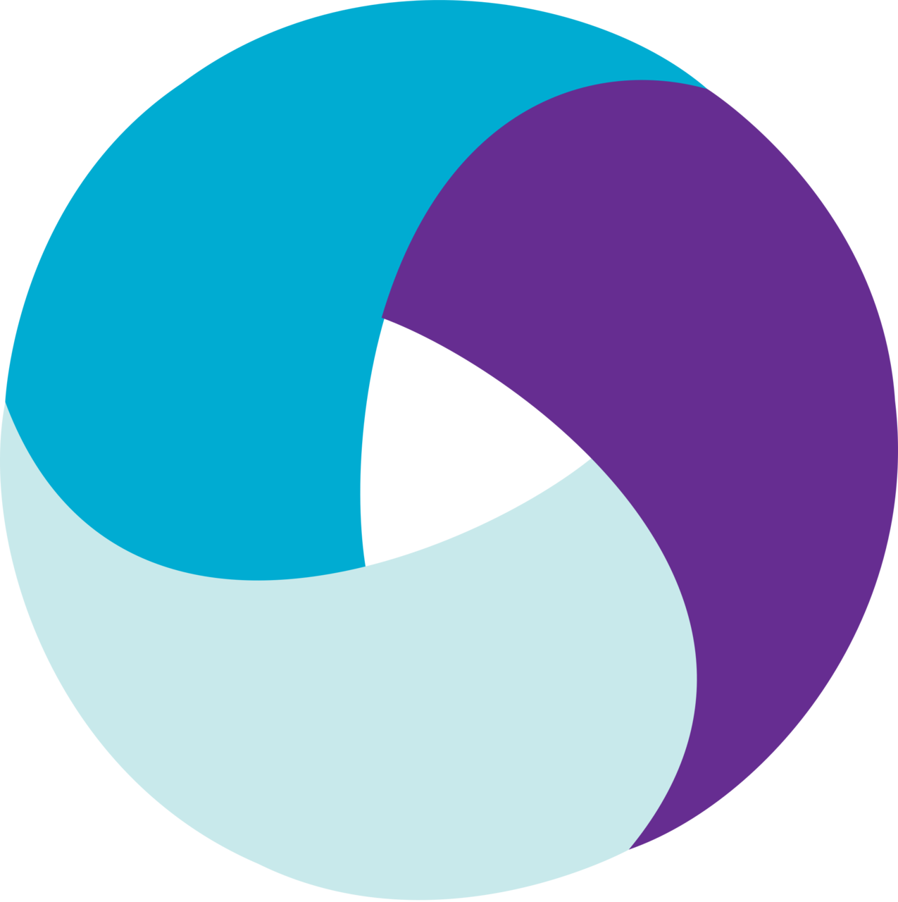

   <h1>
      Hi there!:wave:
   </h1>

<!--About me-->

## :technologist:About me
I am a highly skilled QA Engineer with extensive experience building and implementing effective manual and automated testing processes. I have a strong background in using various testing frameworks and technologies, including Pytest, Requests, Playwright, Selene, REST API, Postman, SQL, and more.
- Contacts:

  &#8287;&#8287;&#8287;&#8287;&#8287;
  
  &#8287;
  
  &#8287;
  

  
  
<!--Stack and tools-->

&#8287;&#8287;&#8287;&#8287;&#8287;
## :computer:Stack and tools

  <code></code>
  <code></code>
  <code></code>
  <code></code>
  <code></code>
  <code></code>
  <code></code>
  <code></code>
  <code></code>
  <code></code>
  <code></code>
  <code></code>
  <code></code>
  <code></code>
  <code></code>
  <code></code>
  <code></code>
  <code></code>
  <code></code>
  <code></code>
  <code></code>
  <code></code>

  
  
<!--Projects-->

## :floppy_disk:Projects
### UI autotests
#####  [Demo UI Project (Selene)](https://github.com/obojeoboje/diploma_staya)

&#8287;&#8287;&#8287;&#8287;&#8287;
### API autotests
#####  [Demo API Project (Requests)](https://github.com/obojeoboje/demo_api_tests)

&#8287;&#8287;&#8287;&#8287;&#8287;
### Mobile autotests
#####  [Demo Mobile Project (Selene)]()

<!--Git Stats-->

&#8287;&#8287;&#8287;&#8287;&#8287;
## :bar_chart:Git stats

 

